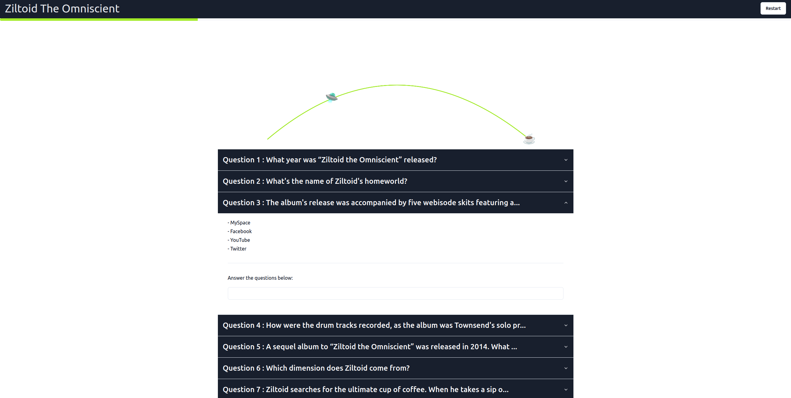

# THM Static Site - Quiz Maker [Svelte]

> Renders questions and shows progress 

Deployed site:  https://alanionita.github.io/thm-static-site/




Loom link: https://www.loom.com/share/17af05e895a9411d81c42894011ce891?sid=406f6f0b-9326-4a25-b2f7-3f7f7355a32e

## Details

Features:
- renders questions, answers
- question validation logic
- shows progress through questions using progress bar and visual graphic
    - graphics use Canvas
- end of the quiz shows the flag


Includes:
- component library: [shadcn-svelte](https://www.shadcn-svelte.com/)  
- css styling: [tailwind](https://tailwindcss.com/)
- custom Canvas component
- Playwright snapshot tests to simplify responsive development
    - see files:
        - /snapshots
        - /test-results
- tested on mobile, tablet, desktop

Designed for:
- 'static-site generation' (SSG) sites or 'progressive web apps' (PWAs) 
- Github Actions CI/CD pipelines
- Github Pages deployments

## 🚀 Usage

As static

```
// install dependencies
npm install

// export the files
npm run build

// see the generated files
npm run preview

```

## Maintaining

### Prerequisites 

```
npm >= 10.8.1
node >= 20.16.0
```

### Install

```shell
npm i
```

### Developing

```shell
npm run dev -- --open
```
*read more on [./SVELTE_README.md](./SVELTE_README.md) or from individual project documentation sites

### Tests

Generate screenshots

```
npm run test:visual
```

Playwright testing

```
npm run test:integration
```

## 📝 License

GNU Affero General Public License (AGPL)

## Author

Copyright © 2024 [Alan Ionita](https://github.com/alanionita).<br />
